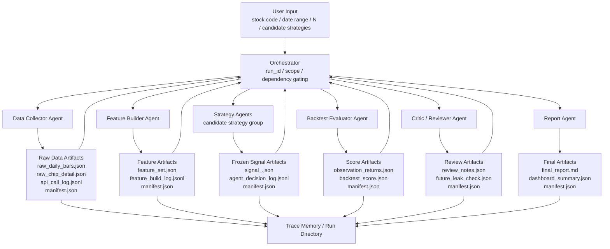
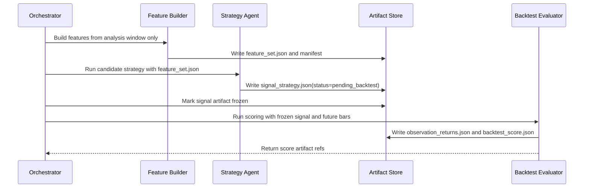
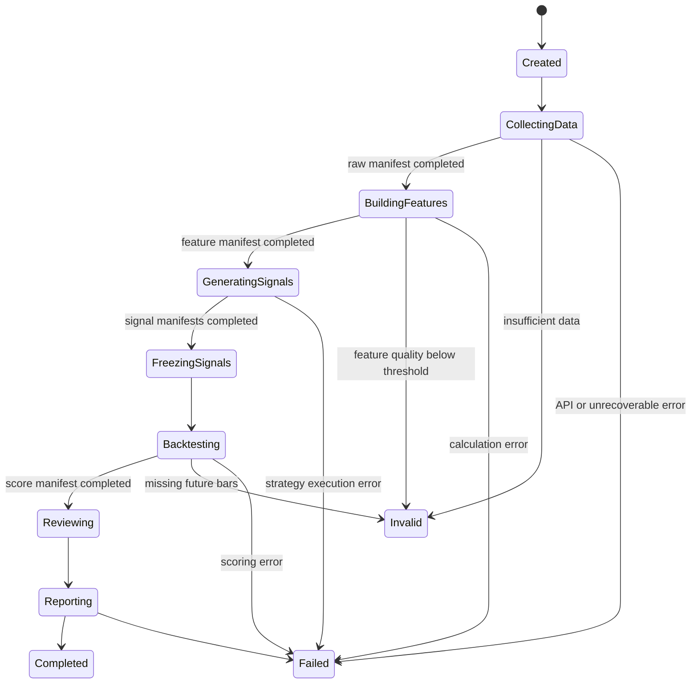

# Multi-Agent Research Workflow Design

## Status

Draft created on 2026-04-29. This is a design document only.

This document formalizes the agent collaboration model for the chip-factor research workflow. It should be read together with:

- [chip-factor-autoresearch-agent.md](./chip-factor-autoresearch-agent.md)
- [chip-change-feature-set.md](./chip-change-feature-set.md)
- [../references/chip-change-strategy-traceability.md](../references/chip-change-strategy-traceability.md)

## Pattern Name

Recommended interview name:

**Supervisor-Orchestrated, Artifact-Driven Multi-Agent Research Workflow**

Chinese shorthand:

**指挥家调度的产物驱动型多 Agent 研究工作流**

Short explanation:

> A central orchestrator controls the experiment boundary, dependency readiness, and execution order. Specialized agents do not exchange unstructured chat as their primary interface. They read versioned artifacts, produce new structured artifacts, and write manifests. This keeps the research loop reproducible, auditable, and resistant to future-data leakage.

## Capability

For one stock and many sample start dates, the system can run multiple candidate strategies against a fixed historical experiment definition. Each strategy sees only the first `N` trading days of a sample, emits a frozen signal, and is later scored against `N+1`, `N+3`, `N+5`, `N+15`, `N+30`, `N+60`, `N+90`, and `N+180` outcomes when those future trading days exist. Unavailable future observations are recorded as `N/A`. Every data request, feature snapshot, agent judgment, backtest score, review note, and final conclusion is written to disk.

This first capability is intentionally scoped:

- one stock at a time,
- multiple sample start dates,
- fixed sample window `N`,
- fixed observation offsets `[1, 3, 5, 15, 30, 60, 90, 180]`,
- multiple candidate strategies,
- auditable run artifacts.

## Non-Goals

This workflow does not implement:

- autonomous live trading,
- portfolio allocation,
- cross-stock ranking,
- real-time streaming signals,
- unconstrained agent-to-agent debate,
- black-box investment advice,
- automatic promotion of a strategy without backtest evidence.

## Design Principles

1. **Workflow first, agent assisted**
   - The workflow owns ordering, readiness, validation, and retry policy.
   - Agents own bounded reasoning, explanation, critique, and strategy interpretation.

2. **Artifacts over chat**
   - Agents communicate through structured artifacts.
   - Chat-style messages may be used by the runtime, but persisted artifact references are the durable contract.

3. **Freeze before scoring**
   - Strategy signals are written before future returns are read.
   - Backtest evaluation cannot modify a signal after the fact.

4. **Deterministic where possible**
   - API fetches, feature calculations, and score calculations should be deterministic code paths.
   - LLM agents should not be responsible for arithmetic that can be computed directly.

5. **Defensive validation at every boundary**
   - The orchestrator validates upstream manifests before dispatching downstream work.
   - Each agent also validates its required inputs before running.

6. **Traceability is a product feature**
   - A result is not complete unless its inputs, decisions, and scoring basis can be traced.

## High-Level Flow



## Agent Roles

### Orchestrator

Type:

- deterministic workflow controller,
- preferably normal backend code before any LLM orchestration is introduced.

Responsibilities:

- create `run_id`,
- freeze experiment scope,
- create sample IDs,
- dispatch agents in order,
- validate artifact manifests,
- prevent future-data access before strategy signals are frozen,
- retry or mark failed stages,
- maintain run-level status.

The orchestrator is the "conductor", but it should be thin. It coordinates the research process; it should not invent investment conclusions.

### Data Collector Agent

Responsibilities:

- fetch Tushare chip detail rows,
- fetch daily bars, volume, amount, and price data,
- resolve trading days,
- write API call logs,
- write data quality notes.

Allowed inputs:

- `run-config.yaml`,
- `sample_id`,
- stock code,
- sample start date,
- sample window `N`,
- observation offsets.

Outputs:

- `raw_daily_bars.json`,
- `raw_chip_detail.json`,
- `future_daily_bars.json` if the stage is explicitly collecting future observation data,
- `api_call_log.jsonl`,
- `manifest.json`.

Rules:

- no strategy decision,
- no confidence score,
- no token or credential logging.

### Feature Builder Agent

Responsibilities:

- transform raw data into deterministic feature sets,
- calculate chip-change features,
- calculate market context features,
- write formula notes and quality warnings.

Allowed inputs:

- raw analysis-window chip detail,
- raw analysis-window daily bars,
- feature definitions.

Outputs:

- `feature_set.json`,
- `feature_build_log.jsonl`,
- `manifest.json`.

Rules:

- does not output `BUY`, `HOLD`, or `SELL`,
- does not read future observation returns,
- missing values must be explicit `null`,
- data quality must be attached to the feature set.

### Strategy Agents

Responsibilities:

- apply candidate strategy rules to a frozen feature set,
- output one action per strategy per sample,
- explain which features were used,
- assign rule-condition confidence.

Allowed inputs:

- `feature_set.json`,
- source traceability references,
- candidate strategy definition.

Outputs:

- `signal_<strategy_id>.json`,
- `agent_decision_log.jsonl`,
- `manifest.json`.

Rules:

- cannot read `future_daily_bars.json`,
- cannot read `backtest_score.json`,
- cannot promote a strategy,
- confidence means "how cleanly the rule conditions are met", not guaranteed profit probability.

### Backtest Evaluator Agent

Responsibilities:

- read frozen strategy signals,
- read future bars after the signal is frozen,
- calculate returns at `N+1`, `N+3`, `N+5`, `N+15`, `N+30`, `N+60`, `N+90`, and `N+180` when available,
- score strategy behavior,
- produce comparable metrics.

Allowed inputs:

- frozen signal artifacts,
- future observation bars,
- scoring policy.

Outputs:

- `observation_returns.json`,
- `backtest_score.json`,
- `backtest_results.tsv`,
- `manifest.json`.

Rules:

- cannot modify signal artifacts,
- cannot change observation windows during a run,
- cannot rewrite strategy reasoning after seeing future returns.

### Critic / Reviewer Agent

Responsibilities:

- check for future-data leakage,
- review sample quality,
- identify unstable strategy behavior,
- flag unsupported confidence values,
- identify suspiciously overfit rules.

Allowed inputs:

- run config,
- feature set,
- frozen signals,
- backtest scores,
- manifests.

Outputs:

- `review_notes.json`,
- `future_leak_check.json`,
- `sample_quality_review.json`,
- `manifest.json`.

Rules:

- cannot change scores,
- cannot promote or rewrite previous artifacts,
- can recommend blocking a result from promotion.

### Report Agent

Responsibilities:

- turn artifacts into a human-readable report,
- summarize scope, data quality, strategy performance, failure cases, and next ideas.

Allowed inputs:

- all finalized artifacts from the run.

Outputs:

- `final_report.md`,
- `dashboard_summary.json`,
- `manifest.json`.

Rules:

- must distinguish facts from hypotheses,
- must cite artifact references for important conclusions,
- must not introduce new strategy results that are absent from the run artifacts.

## Artifact Store

Recommended first directory layout:

```text
docs/research-runs/<run_id>/
  run-config.yaml
  run-manifest.json
  samples/
    <sample_id>/
      raw/
        raw_daily_bars.json
        raw_chip_detail.json
        future_daily_bars.json
        manifest.json
      features/
        feature_set.json
        feature_build_log.jsonl
        manifest.json
      signals/
        signal_<strategy_id>.json
        agent_decision_log.jsonl
        manifest.json
      backtest/
        observation_returns.json
        backtest_score.json
        manifest.json
      review/
        review_notes.json
        future_leak_check.json
        manifest.json
  aggregate/
    backtest_results.tsv
    failure_cases.jsonl
    dashboard_summary.json
    final_report.md
```

The existing `chip-factor-autoresearch-agent.md` describes run-level logs. This document adds the per-sample artifact contract and agent handoff model.

## Manifest Contract

Every stage must write a manifest.

Minimum fields:

```json
{
  "run_id": "run-20260429-001",
  "sample_id": "000001.SZ-20260301-N10",
  "stage": "features",
  "status": "completed",
  "created_at": "2026-04-29T09:00:00Z",
  "input_refs": [
    "samples/000001.SZ-20260301-N10/raw/raw_daily_bars.json",
    "samples/000001.SZ-20260301-N10/raw/raw_chip_detail.json"
  ],
  "output_refs": [
    "samples/000001.SZ-20260301-N10/features/feature_set.json"
  ],
  "row_counts": {
    "daily_bars": 10,
    "chip_rows": 990
  },
  "date_coverage": {
    "analysis_start": "20260302",
    "signal_date": "20260313",
    "future_offsets": [1, 3, 5, 15, 30, 60, 90, 180]
  },
  "checksum": {
    "feature_set.json": "sha256:<hex>"
  },
  "error": null
}
```

Status values:

- `pending`
- `running`
- `completed`
- `blocked`
- `failed`
- `invalid`

## Readiness Gating

Agents do not self-start by watching files. The orchestrator decides when an agent is ready to run.

Feature Builder readiness:

```text
Data Collector manifest.status == completed
AND raw_daily_bars.json exists
AND raw_chip_detail.json exists
AND api_call_log.jsonl exists
AND analysis-window daily bar count >= N
AND chip detail row count > 0
AND date coverage satisfies the sample window
AND checksums are present
```

Strategy Agent readiness:

```text
Feature Builder manifest.status == completed
AND feature_set.json exists
AND feature quality status is OK or explicitly allowed as WARN
AND candidate strategy definition exists
AND strategy source/evidence level is recorded
```

Backtest Evaluator readiness:

```text
All required signal manifests are completed or explicitly invalid
AND each completed signal has action, confidence, reason, and used_features
AND future observation bars are present or explicitly marked N/A for all configured offsets
AND signal artifacts are frozen
```

Report Agent readiness:

```text
Backtest aggregate is completed
AND review artifacts are completed or explicitly skipped
AND all invalid samples have reasons
```

Downstream agents should still validate inputs defensively. If validation fails, the agent returns `blocked` with a clear reason instead of partially writing outputs.

## Strategy and Backtest Interaction

The Strategy Agents and Backtest Evaluator interact only through frozen signal artifacts.



This separation prevents future leakage:

- Strategy Agents are "test takers".
- Backtest Evaluator is the "grader".
- Orchestrator is the "exam proctor".
- Artifact Store is the "answer sheet and grading record".

## Run State Machine



Sample-level failures should not automatically fail the whole run. A run can complete with invalid samples if invalid reasons are recorded.

## Access Control by Stage

| Stage | Can read analysis data | Can read future data | Can write signal | Can score | Can promote |
| --- | --- | --- | --- | --- | --- |
| Data Collector | yes | only when collecting raw observation data | no | no | no |
| Feature Builder | yes | no | no | no | no |
| Strategy Agent | features only | no | yes | no | no |
| Backtest Evaluator | frozen signals | yes | no | yes | no |
| Critic / Reviewer | yes | yes | no | no | can recommend |
| Report Agent | finalized artifacts | finalized artifacts | no | no | no |
| Governance decision | summaries | summaries | no | no | yes, with policy |

## Implementation Contract

The first implementation should treat these agents as logical roles, not necessarily separate runtime processes.

Recommended order:

1. Implement the orchestrator as deterministic backend service code.
2. Implement artifact writing and manifest validation.
3. Implement Data Collector and Feature Builder as normal service modules.
4. Implement candidate strategies as deterministic strategy modules.
5. Implement Backtest Evaluator as deterministic scoring code.
6. Add LLM-assisted Critic and Report roles only after deterministic artifacts exist.

This preserves the multi-agent design while keeping the first version testable and debuggable.

## Observability and Audit Requirements

Every run must answer:

- What inputs did the user provide?
- Which commit produced the run?
- Which Tushare calls were made?
- Which rows and dates were collected?
- Which features were calculated?
- Which strategy produced each signal?
- What exactly did each strategy see?
- When was the signal frozen?
- What future returns were observed?
- Which strategy scored well or poorly?
- Which samples were invalid, and why?
- Which conclusion came from fact versus hypothesis?

## Security and Reliability Rules

- Never log Tushare tokens or credentials.
- Validate stock code, date format, `N`, and observation offsets at the API boundary.
- Treat external data as unreliable.
- Record permission errors as data-fetch failures, not generic crashes.
- Do not silently skip missing future bars.
- Do not mutate completed artifacts; write a new run if experiment inputs change.
- Do not let report text become the only copy of a decision. The structured artifact is canonical.

## Open Questions

- Should future observation bars be fetched during Data Collector stage but access-restricted until Backtest stage, or fetched only after signals are frozen?
- Should `confidence` combine data quality, rule strength, and source evidence, or should those remain separate scores?
- Should the first implementation store runs under `docs/research-runs/` or a top-level `research-runs/` directory once artifact volume grows?
- Should each candidate strategy be a separate callable module, or one strategy registry with separate strategy definitions?
- Should the Critic role be deterministic first, with LLM critique added later?

## Handoff

This design is ready for implementation planning. The next implementation plan should cover:

- run configuration schema,
- per-sample artifact paths,
- manifest writer and validator,
- orchestrator state transitions,
- one deterministic candidate strategy registry,
- multi-horizon scoring with N/A handling,
- browser UI for selecting one stock and multiple start dates.
